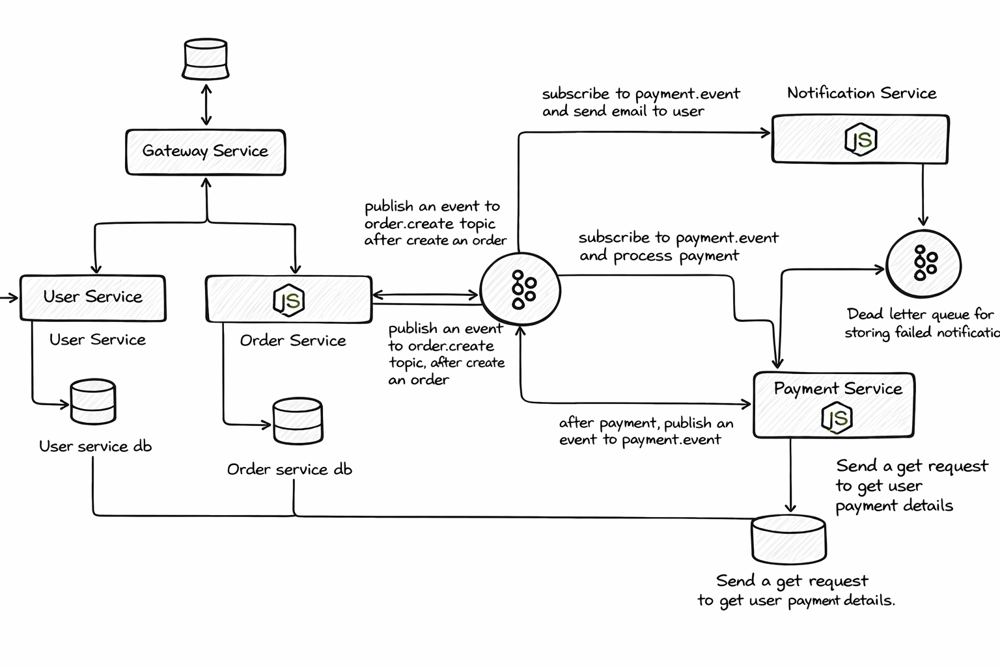

# Payment Processing Microservices Architecture

## Overview

This project implements a **microservices-based payment processing system** designed for scalability, fault tolerance, and maintainability. The system consists of five independent services:

* Gateway Service
* User Service
* Order Service
* Payment Service
* Notification Service

Communication between services is achieved using a combination of **REST APIs** and **Apache Kafka**, following an **event-driven architecture**.

---

## Architecture Summary

* **Synchronous Communication:** REST APIs
* **Asynchronous Communication:** Kafka Topics
* **Loose Coupling:** Services operate independently
* **Scalability:** Each service can scale independently

---

## Services Breakdown

### 1. Gateway Service

The Gateway Service acts as the **entry point** of the system.

**Responsibilities:**

* Receives incoming HTTP requests
* Routes requests to appropriate services
* Functions as a reverse proxy

---

### 2. User Service

The User Service manages **user data and payment information**.

**Responsibilities:**

* Handles user registration and authentication
* Stores and manages user payment details
* Provides payment data to the Payment Service

**Database:**

* Stores user profiles and payment details

**API Endpoints:**

* `POST /signup` — Register a new user
* `POST /signin` — Authenticate a user
* `POST /add` — Add payment details
* `GET /get/:userId` — Retrieve payment details

---

### 3. Order Service

The Order Service handles **order creation and lifecycle management**.

**Responsibilities:**

* Creates new orders with status "pending"
* Publishes order events to Kafka
* Updates order status based on payment results

**Event Flow:**

* Publishes → `order.create`
* Consumes → `payment.event`

**Database:**

* Stores order data and status

**API Endpoints:**

* `POST /create` — Create a new order
* `GET /status/:orderId` — Get order status

---

### 4. Payment Service

The Payment Service manages **payment processing logic**.

**Responsibilities:**

* Consumes order events from Kafka
* Fetches user payment details from User Service
* Processes payments using Stripe
* Publishes payment results to Kafka

**Event Flow:**

* Consumes → `order.create`
* Publishes → `payment.event`

**Integration:**

* Stripe API for payment processing

---

### 5. Notification Service

The Notification Service handles **user notifications**.

**Responsibilities:**

* Listens to payment events
* Sends email notifications to users
* Handles failures using a Dead Letter Queue (DLQ)

**Event Flow:**

* Consumes → `payment.event`

**Reliability Feature:**

* DLQ stores failed notifications for retry/debugging

---

## Kafka Message Broker

Kafka enables **event-driven communication** between services.

### Topics

* **`order.create`**

  * Produced by: Order Service
  * Consumed by: Payment Service

* **`payment.event`**

  * Produced by: Payment Service
  * Consumed by: Order Service and Notification Service

### Dead Letter Queue (DLQ)

* Used by Notification Service
* Stores failed messages for troubleshooting

---

## Technology Stack

* **Backend:** Node.js, Express
* **Message Broker:** Apache Kafka
* **Database:** PostgreSQL
* **Payment Integration:** Stripe
* **Containerization:** Docker

---

## Conclusion

This architecture ensures:

* High scalability
* Fault tolerance
* Maintainability
* Loose coupling between services

It provides a strong foundation for building real-world distributed systems, especially for payment processing and high-traffic applications.
